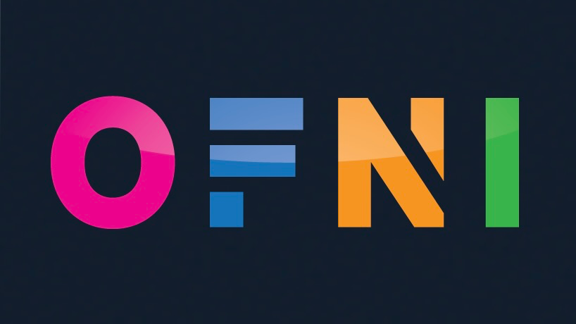

# 🌐 Site Web de l'Association OFNI

Bienvenue dans le dépôt du site web de l'association OFNI des étudiants en informatique de l'Université de Franche-Comté. Ce projet a pour objectif de fournir une plateforme intuitive et moderne pour la communauté étudiante, avec des fonctionnalités dédiées à la gestion des événements, des projets et des ressources partagées.
Ce site a été conçu et développé par Antoine CUINET, votre trésorier de l'association OFNI du bureau de 2024-2025.



## 📋 Table des Matières

- [Présentation](#-présentation)
- [Fonctionnalités](#-fonctionnalités)
- [Arborescence du Site](#️-arborescence-du-site)
- [Technologies Utilisées](#-technologies-utilisées)
- [Installation et Lancement](#️-installation-et-lancement)
- [Auteur et Contact](#-auteur-et-contact)
- [Licence](#-licence)

## 📖 Présentation

Le site web de l'association OFNI est une plateforme centralisée pour les étudiants en informatique, leur permettant de :

- S'informer sur l'association ainsi que sur les événements à venir
- Participer à des projets et des événements étudiants
- Accéder à des ressources pédagogiques et tutoriels
- Suivre les actualités de l'association

## 🚀 Fonctionnalités

- Page d'accueil interactive avec les dernières actualités et événements.
- Gestion des événements avec un calendrier interactif.
- Espace membre avec des cours et des ressources pédagogiques en ligne.
- Adhésion en ligne via un formulaire simple.
- Une boutique en lignes pour des goodies et des places à des événements.
- Partenariats et opportunités de stages pour aider les étudiants à entrer en contact avec des entreprises.

## 🗂️ Arborescence du Site

- Accueil : Présentation de l'association, actualités, événements à venir.
- À propos : Histoire de l'association, équipe du bureau, objectifs, status.
- Événements : Calendrier des événements, inscription, détails.
- Boutique : Formulaire d'inscription pour rejoindre l'association, goodies.
- Espace membre : Cours, tutoriels, annales, ressources pédagogiques

## 💻 Technologies Utilisées

- Frontend : HTML5, CSS3 (SASS), JavaScript
- Backend : PHP
- Base de Données : MySQL
- Versionnage : GitHub

## 🛠️ Installation et Lancement

### Prérequis

- npm

### Installation

1. Tout d'abord, assurez-vous de bien avoir `node.js` d'installé sur votre machine (au moins v20.6.1).

2. Clonez le dépôt du projet :

    ```bash
    git clone https://github.com/AntoineCuinet/ofni-website.git
    cd ofni-website
    ```

3. Afin d'installer les dépendances du projet, ouvrez votre terminal à la racine du projet puis entrez cela :

    ```bash
    npm install
    ```

### Lancement

Afin de lancer le projet, il suffit d'entrez cette ligne de commande dans le terminal, à la racine du projet :

```bash
npm start
```

Une fois cela fait, vous pouvez commencer à coder !

Pour cela, il vous suffit de modifier les fichiers `.php` présent dans le dossier `public` ainsi que les fichiers présent dans le dossier `assets` en respectant l'arborescence des fichiers déjà créer.

NE PAS MODIFIER LE CODE DANS LES FICHIERS `style.css`, cela n'aura aucun impact car nous utilisons le pré-processeur SASS (fichiers `.scss`) !

### Build pour la production

```bash
npm run build-sass
```

## 👥 Auteur et Contact

### Auteur

Antoine CUINET - Développeur Web et membre de l'association
Pour plus d'informations, [voir ce site: portfolio de Antoine CUINET](https://acuinet.fr/)

### Contact

#### Mail

[Antoine CUINET](mailto:antoine@acuinet.fr)

#### Site Web

[Antoine CUINET](https://acuinet.fr/)

## 📜 Licence

Ce site web a été entièrement conçu et développé par l'association OFNI. Toute reproduction, distribution, ou utilisation de ce site, en totalité ou en partie, est strictement interdite sans autorisation préalable de l'association. Pour toute demande d'utilisation ou de collaboration, veuillez contacter l'équipe via la section [Contact](#contact).
